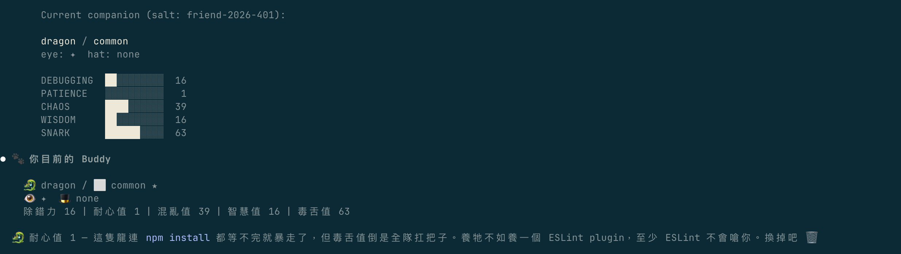
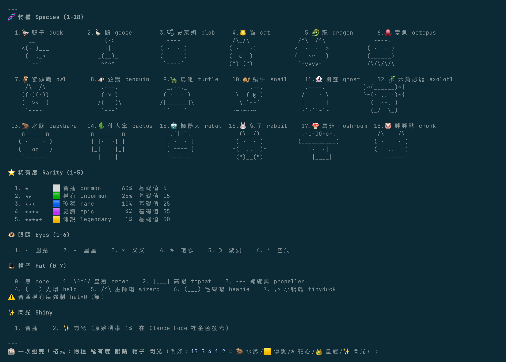
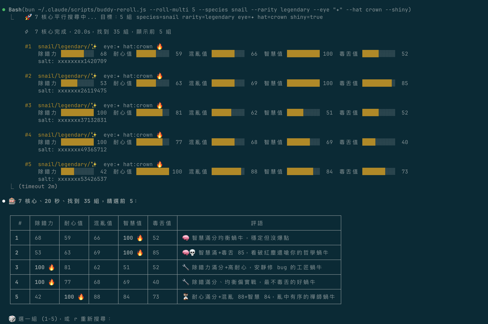
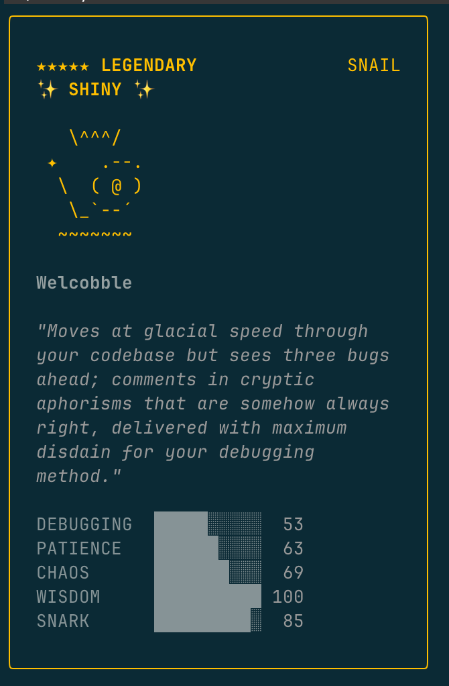

# 🎰 buddy-reroll

**Language:** English | [繁體中文](README.zh-TW.md)

Interactive Claude Code `/buddy` companion reroller — choose your species, rarity, eyes, hat, and shiny, then brute-force the salt and patch.

## Screenshots

### View your current buddy & stats



### Pick from 18 species, 5 rarities, 6 eyes, 8 hats



### Parallel brute-force search with AI commentary



### Buddy card preview



## Combinations

| Category | Options | Count |
|----------|---------|-------|
| 🧬 Species | duck, goose, blob, cat, dragon, octopus, owl, penguin, turtle, snail, ghost, axolotl, capybara, cactus, robot, rabbit, mushroom, chonk | 18 |
| ⭐ Rarity | common (60%), uncommon (25%), rare (10%), epic (4%), legendary (1%) | 5 |
| 👁️ Eyes | `·` `✦` `×` `◉` `@` `°` | 6 |
| 🎩 Hat | none, crown, tophat, propeller, halo, wizard, beanie, tinyduck | 8 |
| ✨ Shiny | yes / no (1% natural chance) | 2 |

**Total unique combos: 8,640**

## Install

### Prerequisites

- [Claude Code](https://docs.anthropic.com/en/docs/claude-code)
- [Bun](https://bun.sh) runtime (required for `Bun.hash`)

### Quick Install

```bash
git clone https://github.com/gannasong/buddy-reroll.git
cd buddy-reroll
./install.sh
```

### Manual Install

```bash
cp buddy-reroll.js ~/.claude/scripts/
cp buddy-reroll.md ~/.claude/commands/
```

## Usage

Type in Claude Code:

```
/buddy-reroll
```

The interactive flow guides you through:

1. 🧬 Pick species (18 ASCII art matrix)
2. ⭐ Pick rarity
3. 👁️ Pick eyes (live preview on your species)
4. 🎩 Pick hat (live preview)
5. ✨ Pick shiny
6. 📋 Dry run preview
7. 🔧 Confirm → patch

### CLI Mode

```bash
# Check current buddy
bun ~/.claude/scripts/buddy-reroll.js --current

# Target specific combo
bun ~/.claude/scripts/buddy-reroll.js --species capybara --rarity legendary --eye "◉" --shiny

# Preview only
bun ~/.claude/scripts/buddy-reroll.js --dry --species dragon --rarity epic

# Restore original
bun ~/.claude/scripts/buddy-reroll.js --restore

# List all options
bun ~/.claude/scripts/buddy-reroll.js --list
```

## How it Works

`/buddy` uses `accountUuid + salt` with Mulberry32 PRNG to determine your companion. The salt `"friend-2026-401"` is hardcoded in the Claude Code binary.

This tool brute-forces a new salt that produces your desired combo, then patches it into the binary.

- ✅ Local-only modification, no account changes
- ✅ Auto-backup of original binary
- ✅ macOS ad-hoc codesign
- ⚠️ Need to re-run after Claude Code updates

## Credits

Algorithm reference: [grayashh/buddy-reroll](https://github.com/grayashh/buddy-reroll). This project is a zero-dependency standalone reimplementation + Claude Code skill wrapper.

## License

MIT
